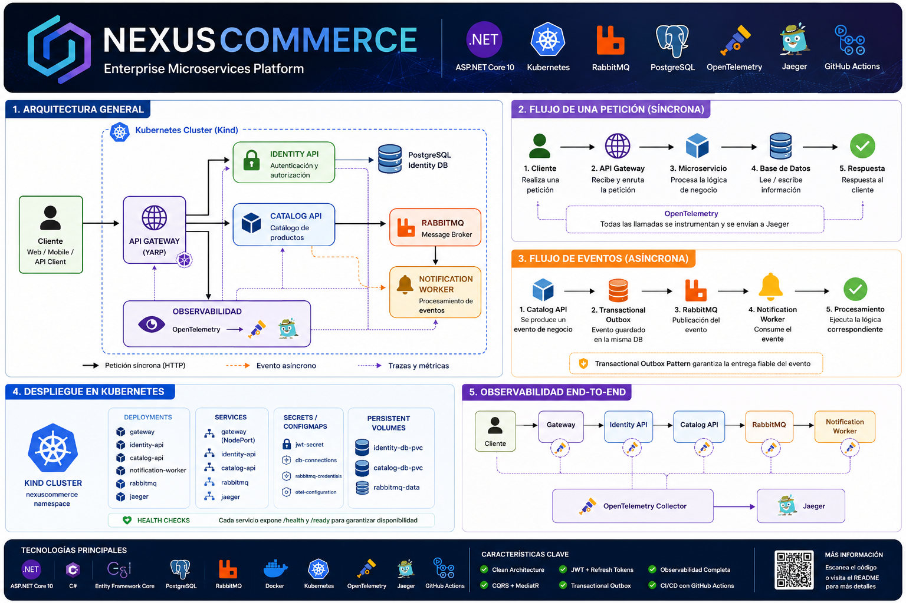

# 🚀 NexusCommerce

> Plataforma de microservicios desarrollada con **ASP.NET Core 10**, **Clean Architecture**, **CQRS**, **RabbitMQ**, **PostgreSQL**, **Docker** y **Kubernetes**.

---

# 📖 Descripción

**NexusCommerce** es una plataforma de microservicios desarrollada para demostrar una arquitectura moderna basada en el ecosistema .NET.

El proyecto aplica principios de **Clean Architecture** y está compuesto por varios servicios independientes que se comunican mediante mensajería asíncrona, permitiendo una solución desacoplada, escalable y preparada para entornos empresariales.

Actualmente incorpora:

- 🔐 Autenticación mediante JWT.
- 📦 Gestión de catálogo de productos.
- 📨 Comunicación asíncrona mediante RabbitMQ.
- 📤 Transactional Outbox Pattern.
- 🐘 PostgreSQL como base de datos.
- 🐳 Contenedores Docker.
- ☸️ Despliegue completo sobre Kubernetes.
- 📡 Observabilidad mediante OpenTelemetry.
- 🔍 Trazabilidad distribuida con Jaeger.
- ⚙️ Integración continua mediante GitHub Actions.

El objetivo del proyecto no es únicamente implementar un CRUD, sino construir una plataforma que represente cómo se desarrolla una aplicación distribuida siguiendo buenas prácticas de arquitectura, observabilidad y despliegue.

---

# ✨ Características implementadas

## Arquitectura

- ✅ Clean Architecture
- ✅ Arquitectura de microservicios
- ✅ API Gateway
- ✅ CQRS
- ✅ MediatR
- ✅ Patrón Repository
- ✅ Inyección de dependencias
- ✅ Principios SOLID

---

## Seguridad

- ✅ Autenticación JWT
- ✅ Refresh Tokens
- ✅ Roles
- ✅ ASP.NET Core Identity
- ✅ Protección de endpoints

---

## Persistencia

- ✅ PostgreSQL
- ✅ Entity Framework Core
- ✅ Migraciones automáticas
- ✅ Bases de datos independientes por microservicio

---

## Comunicación

- ✅ RabbitMQ
- ✅ Publicación de eventos
- ✅ Consumo de eventos
- ✅ Transactional Outbox Pattern

---

## Contenedores y despliegue

- ✅ Docker
- ✅ Docker Compose
- ✅ Kubernetes (Kind)
- ✅ Health Checks
- ✅ Secrets de Kubernetes
- ✅ Despliegue independiente de servicios

---

## Observabilidad

- ✅ OpenTelemetry
- ✅ Jaeger
- ✅ Trazabilidad distribuida
- ✅ Logging centralizado

---

## Calidad

- ✅ GitHub Actions
- ✅ Tests unitarios
- ✅ Tests de integración
- ✅ Integración continua (CI)

---

# 🎯 Objetivo del proyecto

NexusCommerce nace con el objetivo de construir una plataforma de microservicios moderna que sirva como referencia para aplicar buenas prácticas de desarrollo backend utilizando el ecosistema .NET.

El proyecto está orientado a demostrar conocimientos en:

- Arquitectura distribuida.
- Diseño basado en dominios desacoplados.
- Comunicación síncrona y asíncrona entre servicios.
- Observabilidad y trazabilidad distribuida.
- Contenerización y orquestación.
- Automatización mediante integración continua.

Más que desarrollar una aplicación comercial, el objetivo es construir una plataforma técnicamente sólida que pueda evolucionar incorporando nuevos microservicios y funcionalidades siguiendo principios de escalabilidad y mantenibilidad.

---

# 🗺️ Roadmap

## ✅ Funcionalidades implementadas

- [x] Arquitectura de microservicios
- [x] Clean Architecture
- [x] CQRS + MediatR
- [x] ASP.NET Core 10
- [x] API Gateway
- [x] JWT + Refresh Tokens
- [x] ASP.NET Core Identity
- [x] PostgreSQL
- [x] Entity Framework Core
- [x] RabbitMQ
- [x] Transactional Outbox
- [x] Notification Worker
- [x] Docker
- [x] Docker Compose
- [x] Kubernetes (Kind)
- [x] Health Checks
- [x] OpenTelemetry
- [x] Jaeger
- [x] GitHub Actions
- [x] Tests unitarios
- [x] Tests de integración

---

## 🚧 Próximas mejoras

### Plataforma

- [ ] Redis como caché distribuida
- [ ] API Gateway con validación centralizada de JWT
- [ ] Configuración mediante ConfigMaps
- [ ] Gestión avanzada de secretos

### Observabilidad

- [ ] Prometheus
- [ ] Grafana
- [ ] Métricas personalizadas
- [ ] Dashboards de monitorización

### Infraestructura

- [ ] Despliegue en Azure
- [ ] Azure Container Registry
- [ ] Azure Database for PostgreSQL
- [ ] Azure Container Apps o AKS

### Funcionalidad

- [ ] Frontend en React
- [ ] Gestión de pedidos
- [ ] Carrito de compra
- [ ] Gestión de clientes
- [ ] Sistema de inventario

---

# 🎯 Objetivos del proyecto

Con este proyecto pretendo profundizar en el desarrollo de aplicaciones distribuidas utilizando tecnologías modernas del ecosistema .NET.

Además del desarrollo de los propios microservicios, el objetivo es adquirir experiencia práctica en:

- Arquitectura empresarial.
- Contenerización.
- Orquestación con Kubernetes.
- Mensajería asíncrona.
- Observabilidad.
- Integración continua.
- Buenas prácticas de diseño de software.

Cada nueva funcionalidad incorporada busca acercar el proyecto a un entorno de producción real.

---

# 💼 Competencias demostradas

Este proyecto ha sido desarrollado con el objetivo de aplicar tecnologías y patrones utilizados en entornos empresariales.

A través de NexusCommerce se ponen en práctica conocimientos relacionados con:

## Backend

- Desarrollo de APIs REST con ASP.NET Core 10.
- Diseño de aplicaciones siguiendo Clean Architecture.
- Implementación del patrón CQRS mediante MediatR.
- Gestión de autenticación y autorización con JWT.
- Entity Framework Core y migraciones.
- Validación y manejo global de excepciones.

---

## Arquitectura

- Diseño de una plataforma basada en microservicios.
- Separación de responsabilidades por dominio.
- Desacoplamiento mediante mensajería asíncrona.
- Transactional Outbox Pattern.
- Reutilización de componentes mediante Building Blocks.

---

## DevOps

- Contenerización con Docker.
- Orquestación mediante Kubernetes (Kind).
- Health Checks para despliegues seguros.
- Gestión de Secrets.
- Automatización mediante GitHub Actions.

---

## Observabilidad

- Instrumentación con OpenTelemetry.
- Trazabilidad distribuida mediante Jaeger.
- Seguimiento de peticiones entre microservicios.

---

## Calidad

- Pruebas unitarias.
- Pruebas de integración.
- Integración continua.
- Organización del código siguiendo buenas prácticas.

---

# 📚 Tecnologías principales

| Tecnología | Uso dentro del proyecto |
|------------|-------------------------|
| ASP.NET Core 10 | Desarrollo de microservicios |
| C# | Lenguaje principal |
| Entity Framework Core | Persistencia |
| PostgreSQL | Base de datos |
| RabbitMQ | Mensajería |
| Docker | Contenedores |
| Kubernetes | Orquestación |
| OpenTelemetry | Instrumentación |
| Jaeger | Trazabilidad |
| GitHub Actions | Integración continua |

---

# 🖼️ Arquitectura de la plataforma

La siguiente imagen resume la arquitectura completa de **NexusCommerce**, mostrando la comunicación entre microservicios, la infraestructura Kubernetes, la mensajería asíncrona, la persistencia y la observabilidad.

    

---

# 📑 Índice

- [📖 Descripción](#-descripción)
- [🖼️ Arquitectura](#️-arquitectura-de-la-plataforma)
- [✨ Características](#-características-implementadas)
- [🛠️ Tecnologías](#-tecnologías-principales)
- [📂 Organización del proyecto](#-organización-del-proyecto)
- [🚀 Puesta en marcha](#-cómo-ejecutar-el-proyecto)
- [💼 Competencias demostradas](#-competencias-demostradas)
- [🗺️ Roadmap](#️-roadmap)

---

